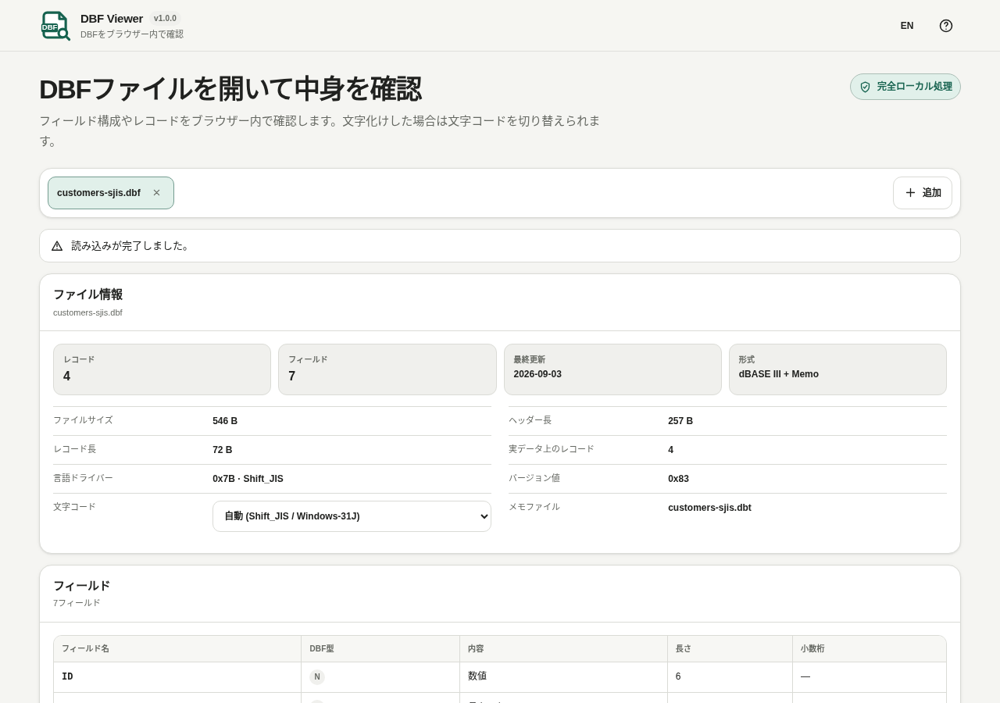

# DBF Viewer

ヘッダーの言語切り替えは EN / JA で統一し、切り替え先とヘルプの説明は表示言語に合わせます。バージョンは vMAJOR.MINOR.PATCH 形式で、バッジは「完全ローカル処理」/「Fully local processing」のままです。

[](https://github.com/ttomohisa/htmlapps-dbf-viewer/actions/workflows/deploy-pages.yml)
[](LICENSE)
[](https://ttomohisa.github.io/htmlapps-dbf-viewer/)

[English README](README.md)

DBFファイルを外部へアップロードせず、フィールド定義・レコード・文字コード・DBT/FPTメモをブラウザ内だけで確認できる単一HTMLビューアです。

## 🚀 デモ

### [GitHub PagesでDBF Viewerを開く](https://ttomohisa.github.io/htmlapps-dbf-viewer/)

GitHub Pagesから最初のHTMLを読み込んだ後、選択したファイルは端末内で読み込み・処理されます。アプリからファイル内容を外部サーバーへアップロードしません。

[](https://ttomohisa.github.io/htmlapps-dbf-viewer/)

## 主な機能

- **DBFの構造を確認** — DBFバージョン、更新日、レコード数、フィールド定義、レコード長、ヘッダー長、Language Driver情報を確認できます。
- **ページ単位でレコードを読む** — DBF全体をJavaScriptオブジェクトへ展開せず、現在ページに必要なレコードだけ読み込みます。
- **古い文字コードに対応** — 文字化けした場合はShift_JIS / Windows-31Jなどへ切り替えて確認できます。
- **同じフィールドを順に確認** — セルの内容画面の「前のレコード」「次のレコード」で、現在ページの並べ替え順・削除済み行の表示設定に従って移動できます。
- **メモデータも確認** — 同名の `.dbt` / `.fpt` を関連付け、必要なMemoセルだけオンデマンドで読み込みます。
- **削除済みレコードを確認** — 削除フラグ付きレコードの表示・非表示を切り替えられます。元ファイルは変更しません。
- **表示中データを確認・保存** — 表示列、現在ページのソート、Cell Inspector、現在ページのUTF-8 CSVコピー／保存に対応します。
- **複数ファイルを扱う** — 複数DBFを同時に開け、ステータス・エラー・表示内容はファイルタブごとに分離されます。

## すぐに使う

### Webで使う

[デモを開く](https://ttomohisa.github.io/htmlapps-dbf-viewer/)だけで利用できます。インストールやアカウント登録は不要です。

### 単一HTMLをダウンロードして使う

1. リポジトリから [`dist/index.html`](https://github.com/ttomohisa/htmlapps-dbf-viewer/blob/main/dist/index.html) をダウンロードします。
2. 最新のChromiumベースブラウザ、Firefox、Safariで直接開きます。

`dist/index.self-extract.html` も収録しています。こちらはブラウザ内で可読版HTMLを復元してから起動するSelf-extract版です。

### ローカルでビルドする

1. このリポジトリをダウンロードまたはクローンします。
2. Windowsで `build-standalone.bat` をダブルクリックします。
3. `dist/index.html` と `dist/index.self-extract.html` が生成され、単一HTMLとして検証されます。
4. 生成されたHTMLを端末上で直接開きます。

Python、Node.js、ローカルWebサーバーは不要です。Windows PowerShellと標準の `tar.exe` を使用します。

## 使い方

1. `.dbf` ファイルを1つ以上追加します。Memoフィールドがある場合は、対応する `.dbt` / `.fpt` も一緒に追加します。
2. ファイル情報とフィールド定義を確認します。
3. ページ操作でレコードを確認します。古い日本語DBFなどで文字化けした場合は文字コードを切り替えます。
4. 必要に応じて削除済みレコードの表示をONにします。
5. セルをクリックして値全体を確認します。「前のレコード」「次のレコード」で画面を閉じずに同じフィールドを確認でき、現在ページの最初・最後の表示行で止まります。Memo内容は必要なときだけ読み込み、完了後に「値をコピー」が使えるようになります。
6. 現在ページをUTF-8 CSVとしてコピーまたは保存します。

レコード移動や画面を閉じた後に古いメモの結果・エラーが届いても、現在の値を上書きしません。ページ・ファイル・文字コードを変更するとセルの内容画面を閉じます。

CSV出力は読み込みが完了した現在ページが対象です。処理中や読み込みエラー時は利用できません。出力開始時の列・行・文字コード・メモ・ファイル名を保持します。タブやページを切り替えても開始済みの出力はその内容で完了します。元のタブを閉じるか同じファイルで新しい出力を開始すると、ブラウザーに渡す前の未完了の出力を中止します。

## GitHub Pagesで公開する

このリポジトリには、単一HTMLをビルドして `dist/` をGitHub Pagesへ自動公開するワークフローが含まれています。

1. リポジトリ名を `htmlapps-dbf-viewer` としてGitHubへプッシュします。
2. **Settings → Pages → Build and deployment → Source** で **GitHub Actions** を選択します。
3. `main` ブランチへプッシュするか、Actions画面から **Deploy standalone app to GitHub Pages** を手動実行します。
4. ビルド成功後、`https://ttomohisa.github.io/htmlapps-dbf-viewer/` で公開されます。

`main` へのプッシュ時にはリポジトリ検査、単一HTMLの再生成、検証を行い、GitHub Pagesが有効な場合に確認済みの `dist/` を公開します。

## 開発とビルド

```text
.
├─ src/index.template.html       # アプリ本体のテンプレート
├─ app.config.json               # アプリ情報・バージョン・ビルド設定
├─ dependencies.json             # 実行時依存の宣言
├─ dependencies.lock.json        # 依存ロック情報
├─ build-standalone.bat          # Windows用ビルド入口
├─ build-standalone.ps1          # 単一HTMLビルダー
├─ scripts/check-repository.ps1  # リポジトリ／ビルド検査
├─ dist/index.html               # 可読版の単一HTML
├─ dist/index.self-extract.html  # Self-extract版の単一HTML
└─ .github/workflows/
   ├─ build-standalone.yml       # ビルド検証
   └─ deploy-pages.yml           # GitHub Pages自動公開
```

### ビルドと検査

```bat
build-standalone.bat
```

リポジトリ検査だけを直接実行する場合：

```powershell
powershell.exe -NoLogo -NoProfile -ExecutionPolicy Bypass -File .\scripts\check-repository.ps1
```

ビルド／検査では、依存ロック、未置換プレースホルダー、実行時通信の制約、単一HTML生成、Self-extract版の生成・復元検証などを確認します。

回帰検査には Node.js 24 が必要です。ビルド後に `node tests/run-tests.cjs` でソース、可読版、ルート配布版、Self-extractの復元内容を検査します。ソース変更後は生成済みの `dist/index.html` を `dbf-viewer.html` にコピーしてから最終のリポジトリ検査を実行してください。ブラウザー、クリップボード、ダウンロード、file:// の確認は別途手動で行います。

## プライバシーと通信防止

生成された単一HTMLには `connect-src 'none'` を含むContent Security Policyがあります。選択したファイルはブラウザのFile APIで読み込まれ、端末内に留まります。アプリはAnalytics、Telemetry、外部API、実行時CDNを必要としません。

GitHub Pages版では最初のHTML配信だけ通信が発生します。その後、選択したファイルはアプリ内でローカル処理されます。ネットワークを完全に切って使う場合は `dist/index.html` を直接開いてください。


## 制限事項

- 閲覧専用です。レコードやフィールドを編集してDBFへ書き戻す機能はありません。
- `.ndx` / `.mdx` / `.cdx` などのインデックスファイルは使用しません。
- DBFには多数の歴史的な方言があるため、未知のフィールド型は保守的に扱います。
- Memoは一般的なDBT/FPTレイアウトを対象としています。
- CSV保存はDBF全体ではなく現在ページが対象です。

## 依存関係

DBF Viewer v1.0.1 は、実行時のサードパーティJavaScriptライブラリを同梱していません。

形式・プロジェクトに関する補足は [THIRD_PARTY_NOTICES.md](THIRD_PARTY_NOTICES.md) を確認してください。

## コントリビューション

バグ報告や機能提案はGitHub Issuesからお願いします。開発への参加方法は [CONTRIBUTING.md](CONTRIBUTING.md) を確認してください。

## ライセンス

Copyright © 2026 ttomohisa

このプロジェクトは [MIT License](LICENSE) で公開されています。
