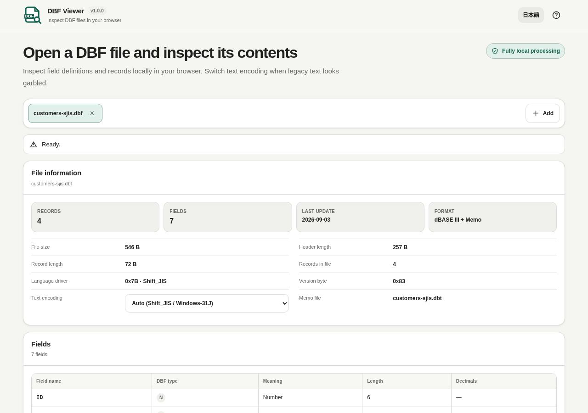

# DBF Viewer

The header uses EN / JA language targets with localized accessible names and Help titles; the version follows vMAJOR.MINOR.PATCH. The local-processing badge remains 完全ローカル処理 / Fully local processing.

[](https://github.com/ttomohisa/htmlapps-dbf-viewer/actions/workflows/deploy-pages.yml)
[](LICENSE)
[](https://ttomohisa.github.io/htmlapps-dbf-viewer/)

[日本語版 README](README.ja.md)

A privacy-focused, single-HTML viewer for opening DBF files, inspecting field definitions and records, switching legacy text encodings, and reading DBT/FPT memo data without uploading selected files to a server.

## 🚀 Live demo

### [Open DBF Viewer on GitHub Pages](https://ttomohisa.github.io/htmlapps-dbf-viewer/)

GitHub Pages delivers the initial HTML. After it loads, selected files are read and processed locally on your device. The app does not upload the file contents.

[](https://ttomohisa.github.io/htmlapps-dbf-viewer/)

## Features

- **Inspect DBF structure** — Review DBF version, update date, record count, field definitions, record size, header size, and language-driver information.
- **Read records page by page** — Only the requested page is materialized instead of expanding the entire DBF into JavaScript objects.
- **Handle legacy text encodings** — Switch decoding when text is garbled, including Shift_JIS / Windows-31J.
- **Compare the same field across records** — Use Previous record / Next record inside Cell Inspector, following the current page’s sort and deleted-row visibility.
- **Read memo data when available** — Attach matching `.dbt` / `.fpt` files by basename and load memo blocks on demand.
- **Review deleted records** — Show or hide records marked as deleted without modifying the source file.
- **Inspect and export what you see** — Choose visible columns, sort the current page, open full cell values, and copy or save the current page as UTF-8 CSV.
- **Work with multiple files** — Open several DBF files in one session with status, errors, and displayed data isolated per file tab.

## Quick start

### Use the web demo

Just [open the demo](https://ttomohisa.github.io/htmlapps-dbf-viewer/). No installation or account is required.

### Use the standalone HTML

1. Download [`dist/index.html`](https://github.com/ttomohisa/htmlapps-dbf-viewer/blob/main/dist/index.html) from this repository.
2. Open it directly in a current Chromium-based browser, Firefox, or Safari.

The repository also includes `dist/index.self-extract.html`, a self-extracting single-HTML variant that restores the readable standalone HTML in the browser before the app starts.

### Build it locally

1. Download or clone this repository.
2. Double-click `build-standalone.bat` on Windows.
3. The build generates and verifies `dist/index.html` and `dist/index.self-extract.html`.
4. Open either generated file directly from your device.

Python, Node.js, and a local web server are not required. The builder uses Windows PowerShell and the built-in `tar.exe`.

## Usage

1. Add one or more `.dbf` files. If the database uses memo fields, add the matching `.dbt` or `.fpt` file at the same time.
2. Review the file information and field definitions.
3. Browse records with the paging controls. Change the text encoding if legacy text is garbled.
4. Show deleted records when you need to inspect rows marked as deleted.
5. Click a cell to inspect its full value. Use Previous record / Next record to move through the same field without closing the inspector. It stops at the first/last visible row on the current page. Memo content is loaded only when needed; Copy value becomes available after it finishes.
6. Copy or save the current preview page as UTF-8 CSV.

Switching records or closing the inspector prevents an older memo result or error from replacing the current value. Changing pages, files or encoding closes the inspector.

CSV is available only after the current page finishes loading. It keeps the columns, rows, encoding, memo source and filename captured when export starts, even if you switch tabs or pages. Closing the source tab or starting a newer export from the same file cancels output that has not yet been handed to the browser.

## Publish with GitHub Pages

The repository includes a workflow that builds the standalone HTML and deploys `dist/` to GitHub Pages automatically.

1. Push the repository to GitHub as `htmlapps-dbf-viewer`.
2. Open **Settings → Pages → Build and deployment → Source** and select **GitHub Actions**.
3. Push to `main`, or manually run **Deploy standalone app to GitHub Pages** from the Actions tab.
4. After a successful deployment, the demo is available at `https://ttomohisa.github.io/htmlapps-dbf-viewer/`.

Each push to `main` runs the repository checks, rebuilds the standalone files, and publishes the verified `dist/` output when GitHub Pages is enabled.

## Development and build layout

```text
.
├─ src/index.template.html       # Application template
├─ app.config.json               # App metadata, version, and build settings
├─ dependencies.json             # Runtime dependency declarations
├─ dependencies.lock.json        # Dependency lock metadata
├─ build-standalone.bat          # Windows build entry point
├─ build-standalone.ps1          # Standalone HTML builder
├─ scripts/check-repository.ps1  # Repository/build verification
├─ dist/index.html               # Readable single-HTML artifact
├─ dist/index.self-extract.html  # Self-extracting single-HTML artifact
└─ .github/workflows/
   ├─ build-standalone.yml       # Build validation
   └─ deploy-pages.yml           # Automatic GitHub Pages deployment
```

### Build and verify

```bat
build-standalone.bat
```

Repository checks can also be run directly:

```powershell
powershell.exe -NoLogo -NoProfile -ExecutionPolicy Bypass -File .\scripts\check-repository.ps1
```

The build/verification flow checks the dependency lock, generates the standalone artifacts, verifies unresolved placeholders and runtime-network restrictions, and builds/verifies the self-extracting variant.

Node.js 24 is required for regression checks. Run `node tests/run-tests.cjs` after building. Tests exercise source, readable HTML, the root distribution and the restored self-extract payload. After an intentional source change, copy the generated `dist/index.html` to `dbf-viewer.html` before the final repository check. Browser, clipboard, download and file-mode checks remain separate manual checks.

## Privacy and runtime network protection

The generated standalone HTML includes a Content Security Policy with `connect-src 'none'`. Selected files are read through browser file APIs and stay on the device. The app does not require analytics, telemetry, an external API, or a runtime CDN.

The GitHub Pages version requires one initial request to load the HTML. After that, the files you select are processed locally by the app. For use with the network completely disconnected, open `dist/index.html` directly.


## Limitations

- Read-only: records and fields are not edited or written back.
- `.ndx`, `.mdx`, `.cdx`, and other index files are not used.
- DBF has many historical dialects; unknown field types are handled conservatively.
- Memo support targets common DBT/FPT layouts.
- CSV export covers the current preview page, not the full database.

## Dependencies

DBF Viewer v1.0.1 does not bundle third-party runtime JavaScript libraries.

See [THIRD_PARTY_NOTICES.md](THIRD_PARTY_NOTICES.md) for format/project notices.

## Contributing

Bug reports and feature proposals are welcome through GitHub Issues. See [CONTRIBUTING.md](CONTRIBUTING.md) for development guidance.

## License

Copyright © 2026 ttomohisa

Licensed under the [MIT License](LICENSE).
